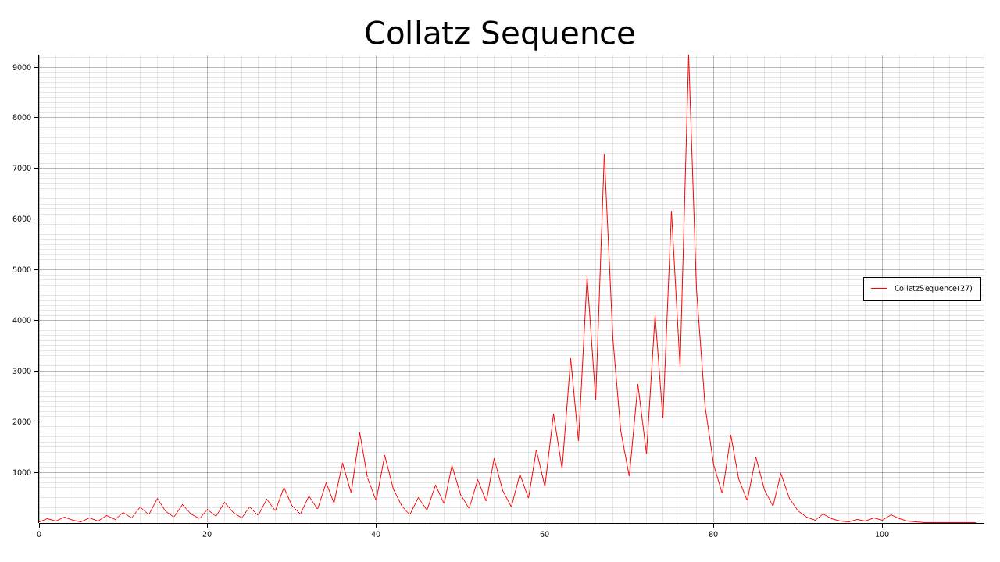

# collatz-conjecture

This project is a WIP and is not meant to be used yet.
Todo list:
- Add `--tree` to compute a CollatzSequence from 1 to n.
- Add `--plot` to `--tree` to visualize the tree.
- Fill author and other informations in Cargo.toml.
- Add memoization for efficient bulk sequence computing.
- Compute steps densitiy for a group of sequences.
- Add github workflow.
- Add markdown style comments to document code.
- Generalize CollatSequence to other forms (5x + 1, negative numbers, etc.)

# Installation

## Additional dependencies

- for plotting: pkg-config libfreetype6-dev libfontconfig1-dev

# Usage

Use `-h` or `--help` for a summary of arguments and options.

## Sequence for a single number
To compute a Collatz sequence from a number n, use `--start` or `-s`:
```terminal
$ cargo run -- --start 10
CollatzSequence { hailstone: [10, 5, 16, 8, 4, 2, 1], starting_number: 10 }
```

## Plotting sequence
To compute a Collatz sequence from a number n, and plot it, use the same command
as above with `--plot` or `-p`. The plot will be saved as `sequence_from_n.png`,
where `n` is the starting number. For example:
```terminal
$ cargo run -- --start 10 --plot
cargo run -- -s 27 -p && display sequence_from_27.png
```


## Benchmarking
Use `-b` or `--benchmark` with a number to compare the efficiency of diverse
methods for computing all steps for the first n numbers. For example:
```terminal
$ cargo run -- -b 100
Time elapsed to compute steps on sequences from 1 to 100: 88.37µs
```
